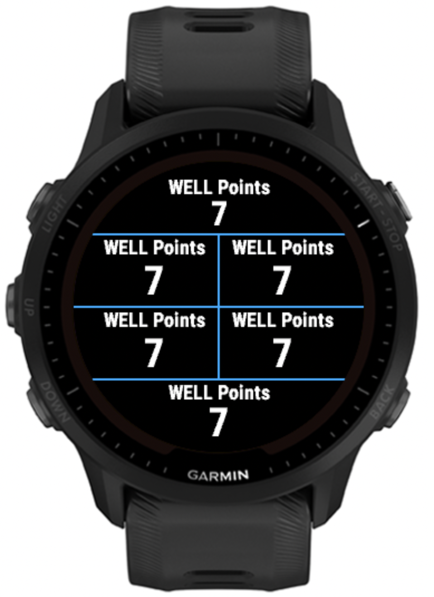

# Garmin Connect IQ WELL Points data field

View WELL Points being earned by your activity in real time!
These points earn benefits as described at https://www.massmutual.com/well.
Note that you still need to connect your LivingWELL by MassMutual app to redeem the points,
this data field is anonymous and not connected to our app.

If you want 8 fields displaying this at the same time, here ya go:

## Install from Connect IQ

Install to your device from the [Connect IQ Store](https://apps.garmin.com/apps/302b47f7-132f-49e4-9299-3f81c305d52e).

## Compiling the app

Refer to instructions from Garmin: https://developer.garmin.com/connect-iq/connect-iq-basics/getting-started/.
I used the VS Code plugin to build this app.
